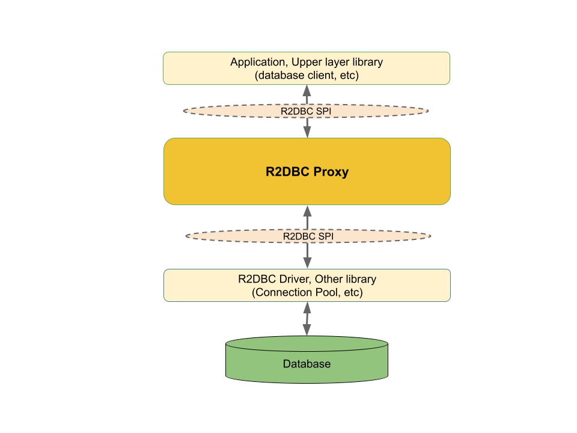

[[introduction]]
= Introduction

R2DBC Proxy is a proxy framework that provides callbacks for query execution,
method invocation, and parameter binding.

The proxy maintains a set of listener implementations. When an application or an upper-layer library
interacts with the proxy, the registered listeners receive callbacks.

The following are common use cases for proxy listeners:

- Query logging
- Slow-query detection
- Method tracing
- Metrics collection
- Distributed tracing
- Assertion and verification
- Custom application actions

The proxy is a thin, transparent layer that is well-suited for implementing cross-cutting concerns
without coupling to the underlying database driver. From the caller's perspective, it still behaves
like a standard R2DBC SPI object.

[[introduction_project-metadata]]
== Project Metadata

* Version control: https://github.com/r2dbc/r2dbc-proxy
* Issue tracker: https://github.com/r2dbc/r2dbc-proxy/issues
* Release repository: https://repo1.maven.org/maven2
* Snapshot repository: https://oss.sonatype.org/content/repositories/snapshots
