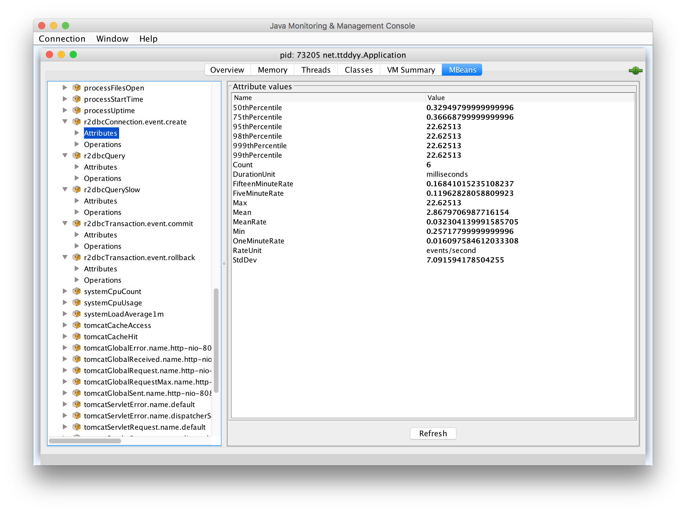

[[use-cases]]
= Use cases
:datasource-proxy: https://github.com/ttddyy/datasource-proxy:
:slow-query-doc: https://ttddyy.github.io/datasource-proxy/docs/current/user-guide/#_slow_query_logging_listener
:r2dbc-proxy-samples: https://github.com/ttddyy/r2dbc-proxy-examples
:TracingExecutionListener: https://github.com/ttddyy/r2dbc-proxy-examples/blob/master/listener-example/src/main/java/io/r2dbc/examples/TracingExecutionListener.java
:MetricsExecutionListener: https://github.com/ttddyy/r2dbc-proxy-examples/blob/master/listener-example/src/main/java/io/r2dbc/examples/MetricsExecutionListener.java

[[use-cases_query-logging]]
== Query logging

At the query executions, registered proxy listeners receive query callbacks,
`[before|after]Query` methods with `QueryExecutionInfo` parameter.
This parameter contains contextual information about the query execution, such as query string, execution type, bindings, execution time, etc.

With the `QueryExecutionInfoFormatter`, which converts `QueryExecutionInfo` to `String`, users can easily
perform query logging.

.Sample Output (wrapped for display purpose)
[source,sql]
----
# Statement with no bindings
#
Thread:reactor-tcp-nio-1(30) Connection:1
Transaction:{Create:1 Rollback:0 Commit:0}
Success:True Time:34
Type:Statement BatchSize:0 BindingsSize:0
Query:["SELECT value FROM test"], Bindings:[]

# Batch query
#
Thread:reactor-tcp-nio-3(32) Connection:2
Transaction:{Create:1 Rollback:0 Commit:0}
Success:True Time:4
Type:Batch BatchSize:2 BindingsSize:0
Query:["INSERT INTO test VALUES(200)","SELECT value FROM test"], Bindings:[]

# Statement with multiple bindings
#
Thread:reactor-tcp-nio-1(30) Connection:3
Transaction:{Create:1 Rollback:0 Commit:0}
Success:True Time:21
Type:Statement BatchSize:0 BindingsSize:2
Query:["INSERT INTO test VALUES ($1,$2)"], Bindings:[(100,101),(200,null(int))]
----

[[use-cases_query-logging_sample-configuration]]
=== Sample Configuration

To perform query logging:

. Create a `QueryExecutionInfoFormatter`
. Use the formatter in after-query callback to convert `QueryExecutionInfo` to a `String` log entry.
. Pass it to the logger.

The **before** query callback(`beforeQuery`) can also perform query logging; however, some attributes are only
available in the **after** query callback(`afterQuery`) such as execution time, success or failure,
result count, etc.

[source,java]
----
QueryExecutionInfoFormatter formatter = QueryExecutionInfoFormatter.showAll();

ConnectionFactory proxyConnectionFactory =
  ProxyConnectionFactory.builder(connectionFactory)    // wrap original ConnectionFactory
                                                       // on every query execution
    .onAfterQuery(execInfo ->
      logger.info(formatter.format(execInfo));         // convert & log
    .build();
----


[[use-cases_slow-query-detection]]
== Slow Query Detection

There are two types of slow query detections - `preemptive` and `non-preemptive`.

- _Preemptive:_ detect slow queries *WHILE* they are running.
- _Non-preemptive:_ detect slow queries *AFTER* they have executed.

The "non-preemptive" slow query detection is simple. On `afterQuery` callback, check the query execution time.
If it took more than your threshold, perform an action such as logging, send notification, etc.

For the "preemptive" slow query detection, you may create a watcher that checks the running queries and notifies
ones that have exceeded the threshold.
In {datasource-proxy}[datasource-proxy], {slow-query-doc}[`SlowQueryListener` is implemented this way].

[[use-cases_slow-query-detection_sample-configuration]]
=== Sample Configuration (Non-preemptive)

On after query execution, check whether the query execution time has exceeded the threshold
time, then perform an action.

[source,java]
----
Duration threshold = Duration.of(...);

ConnectionFactory proxyConnectionFactory =
  ProxyConnectionFactory.builder(connectionFactory)  // wrap original ConnectionFactory
    .onAfterQuery(execInfo -> {
       if(threshold.minus(execInfo.getExecuteDuration()).isNegative()) {
         // slow query logic
       }
    })
    .build();
----


[[use-cases_method-tracing]]
== Method Tracing

When a caller invokes a method on the proxy classes(`ConnectionFactory`, `Connection`, `Batch`, `Statement`, or `Result`),
the registered listeners receive callbacks before and after the target method invocation.

By logging each contextual information of the invoked method, essentially this shows the caller's interactions
with R2DBC SPI objects.

.Sample: Method tracing with transactional calls
[source,sql]
----
  1: Thread:34 Connection:1 Time:16  PostgresqlConnectionFactory#create()
  2: Thread:34 Connection:1 Time:0  PostgresqlConnection#createStatement()
  3: Thread:34 Connection:1 Time:0  ExtendedQueryPostgresqlStatement#bind()
  4: Thread:34 Connection:1 Time:0  ExtendedQueryPostgresqlStatement#add()
  5: Thread:34 Connection:1 Time:5  PostgresqlConnection#beginTransaction()
  6: Thread:34 Connection:1 Time:5  ExtendedQueryPostgresqlStatement#execute()
  7: Thread:34 Connection:1 Time:3  PostgresqlConnection#commitTransaction()
  8: Thread:34 Connection:1 Time:4  PostgresqlConnection#close()
----

[[use-cases_sample-configuration]]
=== Sample Configuration

At `[before|after]Method` callbacks, perform an action such as printing out the invoked method,
creating a span, or updating metrics.

`MethodExecutionInfoFormatter` converts the `MethodExecutionInfo` to `String` for creating a logging entry.

[source,java]
----
MethodExecutionInfoFormatter methodExecutionFormatter = MethodExecutionInfoFormatter.withDefault();

ConnectionFactory proxyConnectionFactory =
  ProxyConnectionFactory.builder(connectionFactory)  // wrap original ConnectionFactory
    // on every method invocation
    .onAfterMethod(execInfo ->
      System.out.println(formatter.format(execInfo)))  // print out method execution (method tracing)
    .build();
```
----

[[use-cases_metrics]]
== Metrics

On method or query callbacks, update the metrics with the provided contextual information.

For example:

- Number of opened connections
- Number of rollbacks
- Method execution time
- Number of queries
- Type of query (SELECT, DELETE, ...)
- Query execution time
- etc.

[[use-cases_metrics_sample-implementation]]
=== Sample Implementation

This sample {MetricsExecutionListener}[MetricsExecutionListener] implementation populates following metrics:

- Time took to create a connection
- Commit and rollback counts
- Executed query count
- Slow query count

In addition, this listener logs slow queries.

.Connection metrics on JMX


.Query metrics on JMX
image::images/metrics-jmx-query.png[Query JMX]

.Transaction metrics on Spring Boot actuator(`/actuator/metrics/r2dbc.transaction`)
image::images/metrics-actuator-connection.png[Transaction Actuator]


[[use-cases_distributed-tracing]]
== Distributed Tracing

Construct tracing spans in appropriate callbacks.

[[use-cases_distributed-tracing_sample-implementation]]
=== Sample implementation

This sample {TracingExecutionListener}[TracingExecutionListener] implementation creates spans.

.Tracing
image::images/zipkin-tracing-rollback.png[Tracing]

.Connection Span
image::images/zipkin-span-connection.png[Connection Span]

.Query Span
image::images/zipkin-span-batch-query.png[Query Span]

[[use-cases_assertion-verification]]
== Assertion/Verification

By inspecting invoked methods and/or executed queries, you can verify whether the logic you inspect has performed
as expected.

For example, by keeping track of connection open/close method calls, connection leaks can be
detected or verified.

Another example is to check the group of queries is executed on the same connection.
This verifies the premise of the transaction - same connection needs to perform the queries in
order for them to be in the same transaction.


[[use-cases_own-action]]
== Own Action (Custom Listener)

Users can write own callback logic that performs any actions, such as audit logging, sending
notifications, calling external system, etc.

[[use-cases_own-action_implementing-custom-listener]]
=== Implementing custom listener

In order to create a custom listener, simply implement `ProxyExecutionListener` or `ProxyMethodExecutionListener`
interface.

[source,java]
----
static class MyListener implements ProxyMethodExecutionListener {
	@Override
	public void afterCreateOnConnectionFactory(MethodExecutionInfo methodExecutionInfo) {
		System.out.println("connection created");
	}
}
----

[[use-cases_support-primitive-and-null-in-result-mapping]]
== Support Primitive and Null in Result Mapping

To consume query results, `Result#map` method accepts a mapping function(`BiFunction`) that takes `Row` and `RowMetadata`.

[source,java]
----
result.map((row, rowMetadata) -> row.get("name", String.class));
----

The `Row#get` method takes a `Class` in the second argument to represent the returning value type(data type).
R2DBC spec does not support primitive types for this data type. Only boxed(wrapper) types are supported.

By modifying the `Row#get` behavior, `ResultRowConverter` can provide support for primitive types.

Following converter transforms a primitive to the corresponding wrapper data type.
(e.g. `row.get(0, int.class)` to `row.get(0, Integer.class)`) +
Also, this converter handles `null` return value.

[source,java]
----
ResultRowConverter converter = (proxyRow, method, args, getOperation) -> {
    if (args.length == 2 && ((Class<?>) args[1]).isPrimitive()) {
        Class<?> boxedType = getWrapperType(args[1]);
        Object result = proxyRow.get((int) args[0], boxedType);
        if (result == null) {
            return getDefaultValue(boxedType);  // null handling
        }
        return result;
    }
    return getOperation.proceed();
};
// implement `getWrapperType()` and `getDefaultValue()` with own strategy
----

[[use-cases_call-different-methods-in-result-mapping]]
== Call different methods in Result Mapping

By modifying the `Row#get` behavior with `ResultRowConverter`, following converters support column names that do not exist.

.Support virtual/derived column
[source,java]
----
ResultRowConverter converter = (proxyRow, method, args, getOperation) -> {
   if ("full_name".equals(args[0])) {
       String firstName = proxyRow.get("first_name", String.class);
       String lastName = proxyRow.get("last_name", String.class);
       return firstName + " " + lastName;
   }
   return getOperation.proceed();   // invoke original method
);
----

.Support column name change
[source,java]
----
ResultRowConverter converter = (proxyRow, method, args, getOperation) -> {
    if ("column_old".equals(args[0])) {
        if (args.length == 1) {
            return proxyRow.get("column_new");
        }
        return proxyRow.get("column_new", (Class<?>)args[1]);
    }
    return getOperation.proceed();   // invoke original method
);
----
