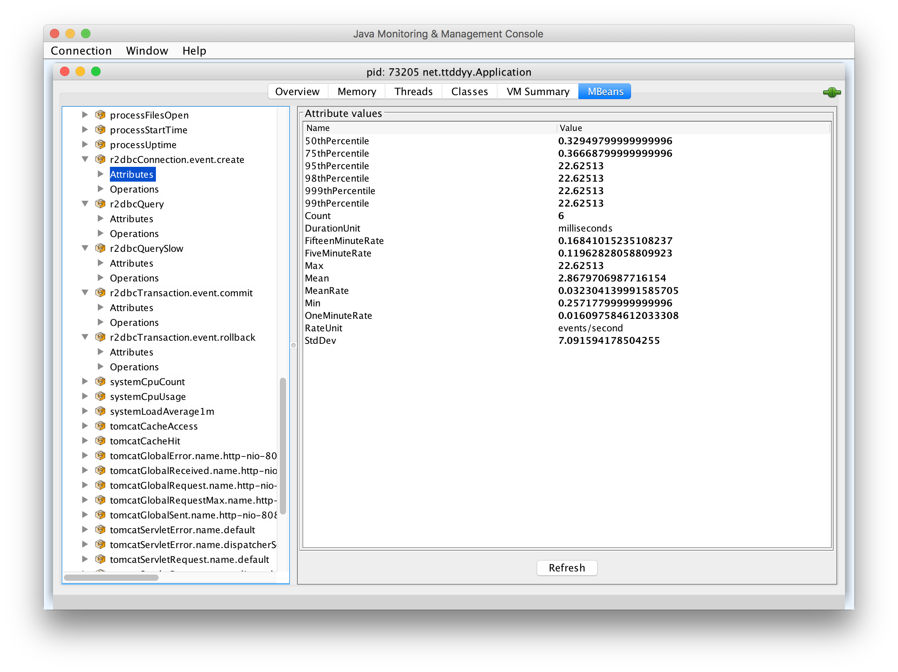
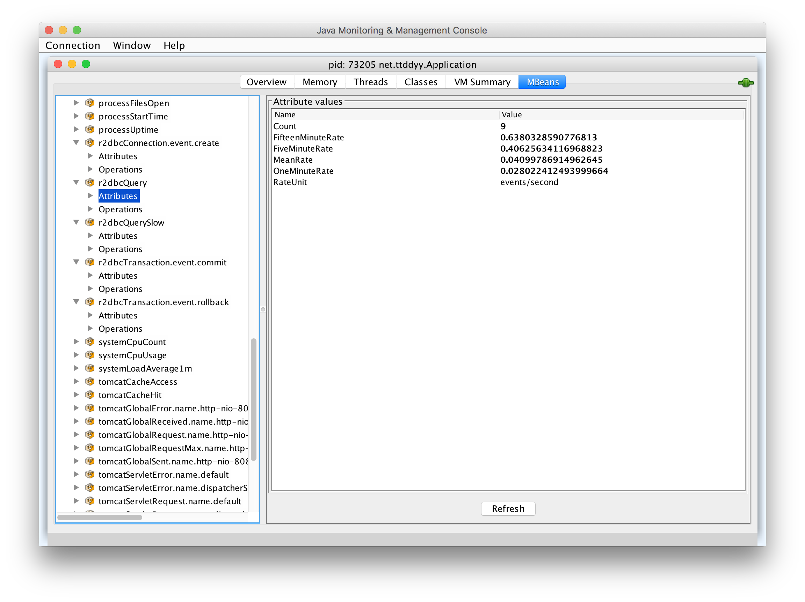
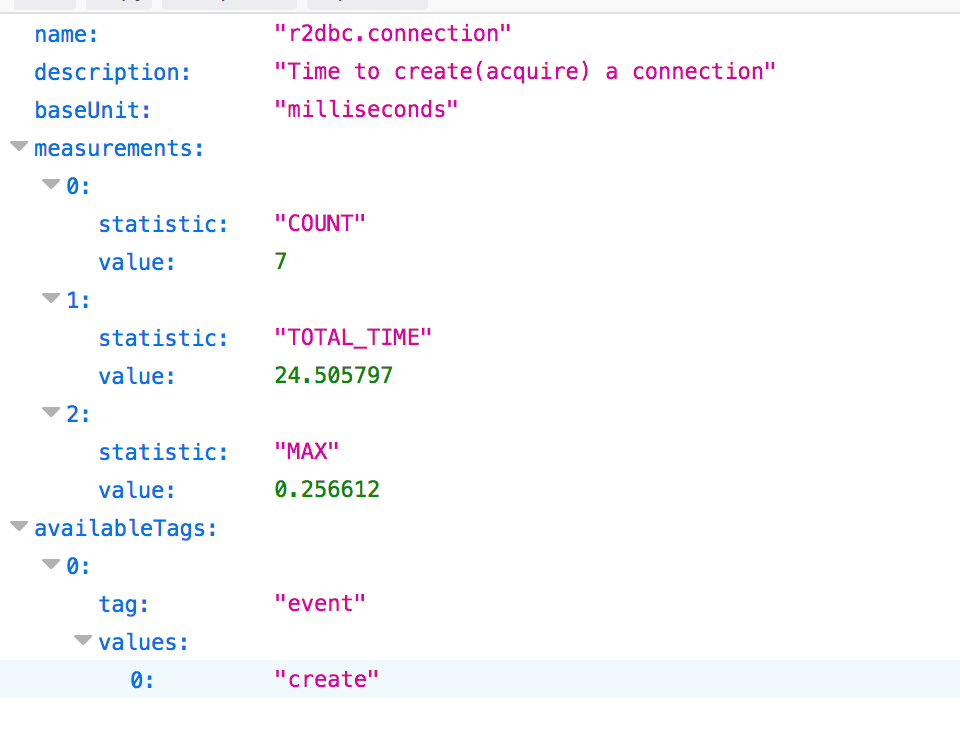
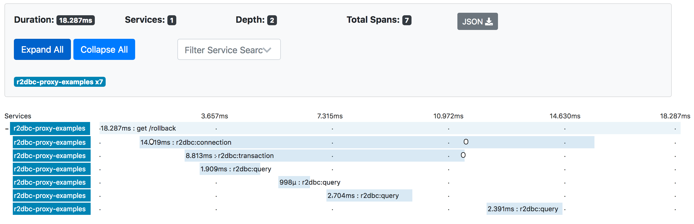
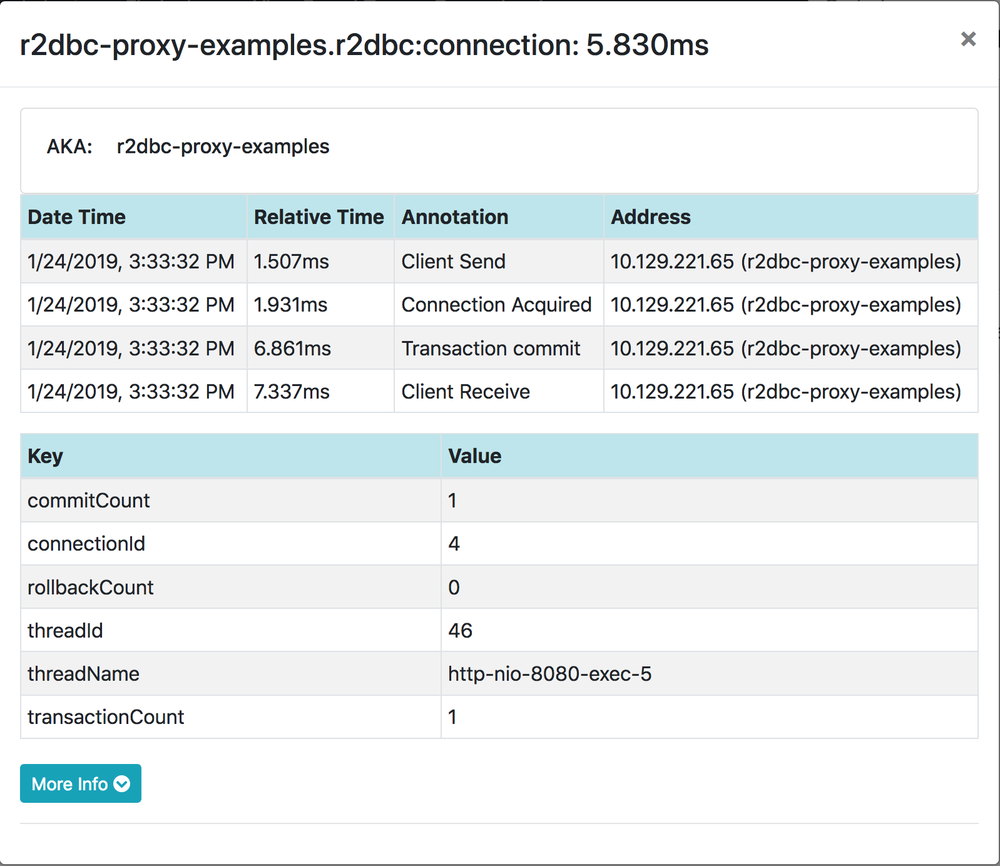
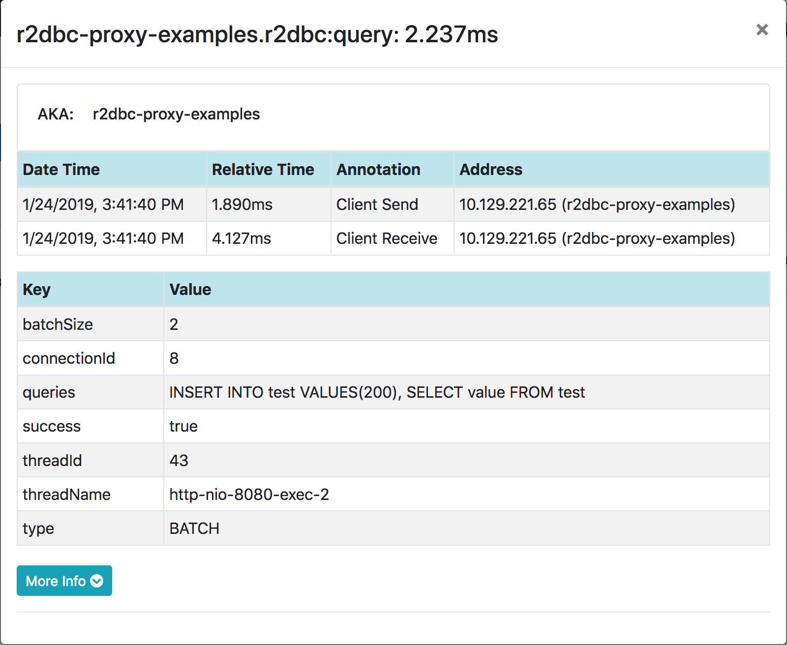

[[use-cases]]
= Use Cases
:datasource-proxy: https://github.com/ttddyy/datasource-proxy
:slow-query-doc: https://jdbc-observations.github.io/datasource-proxy/docs/current/user-guide/index.html#_slow_query_logging_listener
:r2dbc-proxy-samples: https://github.com/ttddyy/r2dbc-proxy-examples
:TracingExecutionListener: https://github.com/ttddyy/r2dbc-proxy-examples/blob/master/listener-example/src/main/java/io/r2dbc/examples/TracingExecutionListener.java
:MetricsExecutionListener: https://github.com/ttddyy/r2dbc-proxy-examples/blob/master/listener-example/src/main/java/io/r2dbc/examples/MetricsExecutionListener.java

[[use-cases_query-logging]]
== Query Logging

At query execution time, registered proxy listeners receive query callbacks via the `[before|after]Query`
methods with a `QueryExecutionInfo` parameter. This object contains contextual information about the query,
including the SQL text, execution type, bindings, execution time, and more.

With `QueryExecutionInfoFormatter`, which converts `QueryExecutionInfo` to a `String`, users can easily perform
query logging.

.Sample output (wrapped for display purposes)
[source,sql]
----
# Statement with no bindings
#
Thread:reactor-tcp-nio-1(30) Connection:1
Transaction:{Create:1 Rollback:0 Commit:0}
Success:True Time:34
Type:Statement BatchSize:0 BindingsSize:0
Query:["SELECT value FROM test"], Bindings:[]

# Batch query
#
Thread:reactor-tcp-nio-3(32) Connection:2
Transaction:{Create:1 Rollback:0 Commit:0}
Success:True Time:4
Type:Batch BatchSize:2 BindingsSize:0
Query:["INSERT INTO test VALUES(200)","SELECT value FROM test"], Bindings:[]

# Statement with multiple bindings
#
Thread:reactor-tcp-nio-1(30) Connection:3
Transaction:{Create:1 Rollback:0 Commit:0}
Success:True Time:21
Type:Statement BatchSize:0 BindingsSize:2
Query:["INSERT INTO test VALUES ($1,$2)"], Bindings:[(100,101),(200,null(int))]
----

[[use-cases_query-logging_sample-configuration]]
=== Sample Configuration

To perform query logging:

. Create a `QueryExecutionInfoFormatter`.
. Use the formatter in the after-query callback to convert `QueryExecutionInfo` into a log entry.
. Pass the formatted value to your logger.

The **before** query callback (`beforeQuery`) can also log queries, but some attributes are only available in
the **after** query callback (`afterQuery`), such as execution time, success/failure status, and result count.

[source,java]
----
QueryExecutionInfoFormatter formatter = QueryExecutionInfoFormatter.showAll();

ConnectionFactory proxyConnectionFactory =
  ProxyConnectionFactory.builder(connectionFactory)    // wrap the original ConnectionFactory
                                                       // on every query execution
    .onAfterQuery(execInfo ->
        logger.info(formatter.format(execInfo))         // convert and log
    )
    .build();
----

[[use-cases_slow-query-detection]]
== Slow Query Detection

There are two common approaches to detect slow queries:

During execution::
Detect slow queries *while* they are running. A watcher can notify when a query exceeds the threshold,
even if it has not finished yet. This approach is sometimes called _preemptive_, but it only reports the
query; the running query is not interrupted or canceled. In {datasource-proxy}[datasource-proxy],
{slow-query-doc}[`SlowQueryListener`] follows this approach.

After execution::
Detect slow queries *after* they complete. The `onAfterQuery` callback can compare query execution time with
a threshold. This is a simple and effective approach for many applications. It is sometimes called
_non-preemptive_.

Both approaches can be used together: use a watcher for early notice of long-running queries and an
`onAfterQuery` callback to record the actual execution time.

[[use-cases_slow-query-detection_sample-configuration]]
=== Sample Configuration (After Execution)

After a query completes, check whether the execution time exceeds the threshold and then perform an action.

[source,java]
----
Duration threshold = Duration.of(...);

ConnectionFactory proxyConnectionFactory =
  ProxyConnectionFactory.builder(connectionFactory)  // wrap the original ConnectionFactory
    .onAfterQuery(execInfo -> {
       if (threshold.minus(execInfo.getExecuteDuration()).isNegative()) {
         // slow-query logic
       }
    })
    .build();
----

[[use-cases_method-tracing]]
== Method Tracing

When a caller invokes a method on the proxy classes (`ConnectionFactory`, `Connection`, `Batch`, `Statement`,
or `Result`), the registered listeners receive callbacks before and after the target method invocation.

By logging the contextual information of each invoked method, you can effectively observe the caller's
interaction with the R2DBC SPI objects.

.Sample: Method tracing with transactional calls
[source,sql]
----
  1: Thread:34 Connection:1 Time:16  PostgresqlConnectionFactory#create()
  2: Thread:34 Connection:1 Time:0  PostgresqlConnection#createStatement()
  3: Thread:34 Connection:1 Time:0  ExtendedQueryPostgresqlStatement#bind()
  4: Thread:34 Connection:1 Time:0  ExtendedQueryPostgresqlStatement#add()
  5: Thread:34 Connection:1 Time:5  PostgresqlConnection#beginTransaction()
  6: Thread:34 Connection:1 Time:5  ExtendedQueryPostgresqlStatement#execute()
  7: Thread:34 Connection:1 Time:3  PostgresqlConnection#commitTransaction()
  8: Thread:34 Connection:1 Time:4  PostgresqlConnection#close()
----

[[use-cases_sample-configuration]]
=== Sample Configuration

In `[before|after]Method` callbacks, you can perform actions such as printing the invoked method,
creating a span, or updating metrics.

`MethodExecutionInfoFormatter` converts `MethodExecutionInfo` into a `String` for log entries.

[source,java]
----
MethodExecutionInfoFormatter methodExecutionFormatter = MethodExecutionInfoFormatter.withDefault();

ConnectionFactory proxyConnectionFactory =
  ProxyConnectionFactory.builder(connectionFactory)  // wrap the original ConnectionFactory
    // on every method invocation
    .onAfterMethod(execInfo ->
      System.out.println(methodExecutionFormatter.format(execInfo))  // print method execution details
    )
    .build();
----

[[use-cases_metrics]]
== Metrics

In method or query callbacks, you can update metrics using the provided contextual information.

Examples include:

- Number of opened connections
- Number of rollbacks
- Method execution time
- Number of queries
- Query type (SELECT, DELETE, ...)
- Query execution time
- etc.

[[use-cases_metrics_sample-implementation]]
=== Sample Implementation

This sample {MetricsExecutionListener}[MetricsExecutionListener] implementation populates the following metrics:

- Time taken to create a connection
- Commit and rollback counts
- Executed query count
- Slow-query count

In addition, this listener logs slow queries.

.Connection metrics on JMX

.Query metrics on JMX

.Transaction metrics on Spring Boot actuator (`/actuator/metrics/r2dbc.transaction`)

[[use-cases_distributed-tracing]]
== Distributed Tracing

Construct tracing spans in the appropriate callbacks.

[[use-cases_distributed-tracing_sample-implementation]]
=== Sample implementation

This sample {TracingExecutionListener}[TracingExecutionListener] implementation creates spans.

.Tracing

.Connection span

.Query span

[[use-cases_assertion-verification]]
== Assertion/Verification

By inspecting invoked methods and/or executed queries, you can verify whether the logic under inspection has
performed as expected.

For example, by tracking connection open/close calls, connection leaks can be detected or verified.

Another example is to check that a group of queries is executed on the same connection. This verifies the
transaction assumption that the same connection must execute all of the queries in order for them to belong to
one transaction.

[[use-cases_own-action]]
== Own Action (Custom Listener)

You can write custom callback logic to perform actions such as audit logging, sending notifications, or
calling external systems.

[[use-cases_own-action_implementing-custom-listener]]
=== Implementing a Custom Listener

To create a custom listener, implement the `ProxyExecutionListener` or `ProxyMethodExecutionListener`
interface.

[source,java]
----
static class MyListener implements ProxyMethodExecutionListener {
    @Override
    public void afterCreateOnConnectionFactory(MethodExecutionInfo methodExecutionInfo) {
        System.out.println("connection created");
    }
}
----

[[use-cases_support-primitive-and-null-in-result-mapping]]
== Support for Primitive and Null Values in Result Mapping

To consume query results, the `Result#map` method accepts a mapping function (`BiFunction`) that takes a `Row`
and a `RowMetadata`.

[source,java]
----
result.map((row, rowMetadata) -> row.get("name", String.class));
----

The `Row#get` method accepts a `Class` as the second argument to represent the return value type (data type).
The R2DBC specification does not support primitive types for this value type; only boxed (wrapper) types are
supported.

`ResultRowConverter` can provide support for primitive values by modifying the behavior of `Row#get`.

The following converter transforms a primitive into the corresponding wrapper type.
For example, `row.get(0, int.class)` becomes `row.get(0, Integer.class)`. This converter also handles a
`null` return value.

[source,java]
----
ResultRowConverter converter = (proxyRow, method, args, getOperation) -> {
    if (args.length == 2 && ((Class<?>) args[1]).isPrimitive()) {
        Class<?> boxedType = getWrapperType(args[1]);
        Object result = proxyRow.get((int) args[0], boxedType);
        if (result == null) {
            return getDefaultValue(boxedType);  // null handling
        }
        return result;
    }
    return getOperation.proceed();
};
// implement `getWrapperType()` and `getDefaultValue()` with your own strategy

// register to ProxyConfig
ProxyConfig proxyConfig = ProxyConfig.builder().resultRowConverter(converter).build();
----

[[use-cases_call-different-methods-in-result-mapping]]
== Calling Different Methods in Result Mapping

By modifying `Row#get` behavior with `ResultRowConverter`, you can support column names that do not exist or
map them to derived values.

.Support a virtual/derived column
[source,java]
----
ResultRowConverter converter = (proxyRow, method, args, getOperation) -> {
   if ("full_name".equals(args[0])) {
       String firstName = proxyRow.get("first_name", String.class);
       String lastName = proxyRow.get("last_name", String.class);
       return firstName + " " + lastName;
   }
   return getOperation.proceed();   // invoke the original method
};
----

.Support a renamed column
[source,java]
----
ResultRowConverter converter = (proxyRow, method, args, getOperation) -> {
    if ("column_old".equals(args[0])) {
        if (args.length == 1) {
            return proxyRow.get("column_new");
        }
        return proxyRow.get("column_new", (Class<?>) args[1]);
    }
    return getOperation.proceed();   // invoke the original method
};
----
